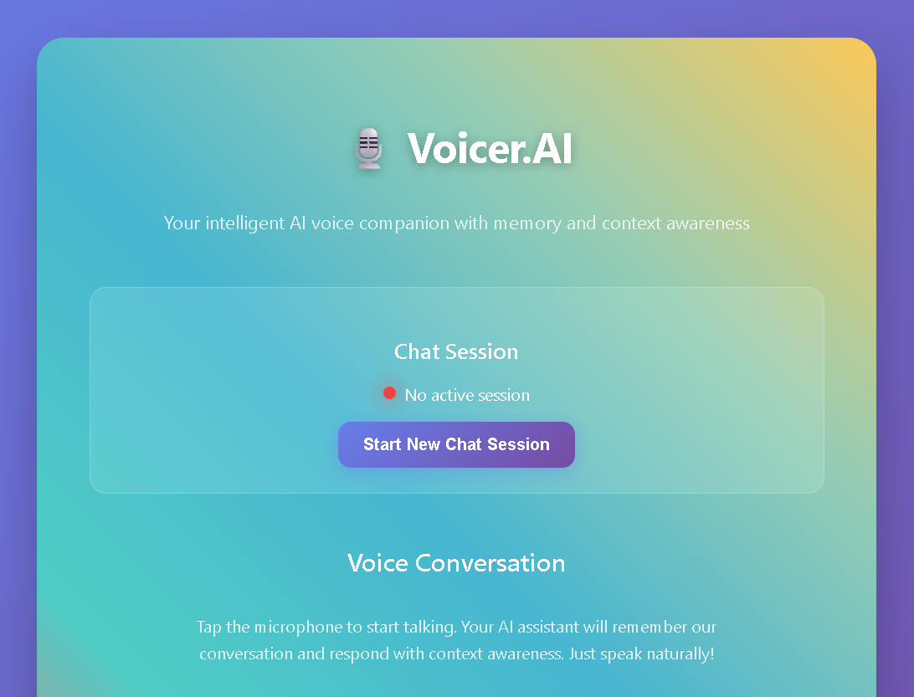
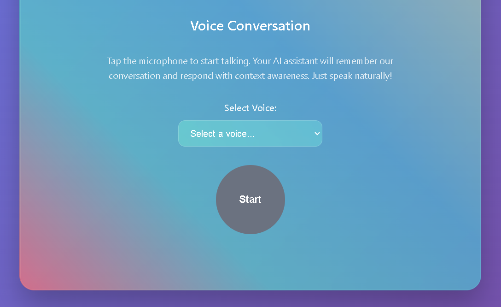
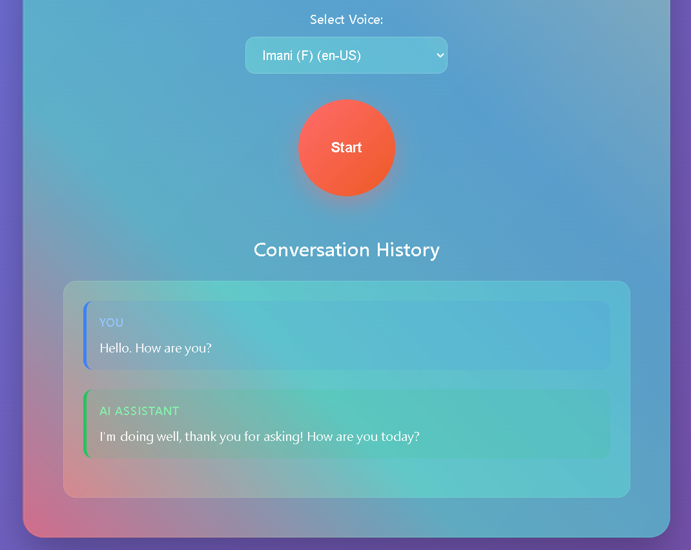
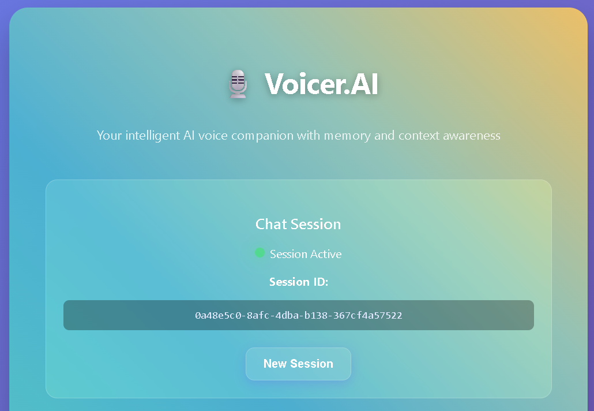

# Voicer.AI: Conversational AI Voice Agent Platform

## 🚀 Project Overview
Voicer.AI is a next-generation, full-stack conversational voice agent platform. It combines real-time speech-to-text, LLM-powered chat, and ultra-realistic TTS, all wrapped in a modern, animated web UI. Designed for rapid prototyping and extensibility, Voicer.AI is your playground for building, testing, and deploying AI voice agents with state-of-the-art APIs.

---

## 🛠️ Technologies Used
- **FastAPI**: Lightning-fast Python web framework for APIs
- **AssemblyAI**: Speech-to-text (STT) transcription (async, robust, accurate)
- **Murf API**: Text-to-speech (TTS) with a wide range of realistic voices
- **Google Gemini (Generative AI)**: LLM for chat, summarization, and more
- **HTML/CSS/JS**: Modern, animated frontend (MediaRecorder, fetch, async UI)
- **pydub + ffmpeg**: (Optional) Audio format conversion for maximum compatibility
- **Python 3.8+**: Core language
- **dotenv**: Secure environment variable management

---

## 🏗️ Architecture
- **Frontend**: Single-page app (SPA) served via FastAPI static files. Uses MediaRecorder for browser-based audio capture, fetch for async API calls, and a beautiful dark UI.
- **Backend**: FastAPI server with endpoints for:
  - `/generate`: TTS via Murf
  - `/voices`: List available Murf voices
  - `/upload_audio`: Save uploaded audio
  - `/transcribe/file`: Transcribe audio (AssemblyAI)
  - `/tts/echo`: Record, transcribe, and echo back as TTS
  - `/llm/query`: Full pipeline: audio → transcript → LLM → TTS
  - `/agent/chat/{session_id}`: Conversational chat with history
- **Transcription**: Audio is uploaded, optionally converted to WAV/MP3, then sent to AssemblyAI for transcription.
- **LLM**: Gemini (Google) for chat, summarization, and context-aware responses.
- **TTS**: Murf API for ultra-realistic voice synthesis.
- **Session Management**: In-memory chat history (can be swapped for Redis, DB, etc.)

---

## ✨ Features
- 🎤 **Echo Bot**: Record your voice, transcribe, and play it back as TTS
- 🗣️ **Voice Selector**: Choose from dozens of Murf voices
- 🤖 **Conversational Agent**: Chat with an LLM using your voice
- 📝 **Real-Time Transcription**: See your words appear instantly
- 🌐 **Modern UI**: Animated, dark-themed, responsive, and beautiful
- 🛡️ **API-First**: All features accessible via clean REST endpoints
- 🔒 **Secure**: API keys and secrets managed via `.env`
- 🧩 **Extensible**: Add new LLMs, TTS, or STT providers easily

---

## ⚡ Quickstart

### 1. Clone the Repo
```sh
git clone <your-repo-url>
cd pro_day_1
```

### 2. Install Python Dependencies
```sh
pip install -r requirements.txt
```

### 3. Install ffmpeg (for audio conversion)
- **Windows**: Download from https://ffmpeg.org/download.html and add to PATH
- **macOS**: `brew install ffmpeg`
- **Linux**: `sudo apt-get install ffmpeg`

### 4. Set Environment Variables
Create a `.env` file in the project root with the following:
```
MURF_API_KEY=your_murf_api_key
ASSEMBLYAI_API_KEY=your_assemblyai_api_key
GEMINI_API_KEY=your_gemini_api_key  # or GOOGLE_API_KEY
```

### 5. Run the FastAPI Server
```sh
uvicorn app:app --reload
```

### 6. Open the App
Go to [http://127.0.0.1:8000](http://127.0.0.1:8000) in your browser.

---

## 🔗 API Endpoints
- `POST /generate` — Generate TTS audio from text
- `GET /voices` — List available Murf voices
- `POST /upload_audio` — Upload and save audio file
- `POST /transcribe/file` — Transcribe audio file (AssemblyAI)
- `POST /tts/echo` — Record, transcribe, and echo as TTS
- `POST /llm/query` — Full pipeline: audio → transcript → LLM → TTS
- `POST /agent/session` — Create a new chat session
- `GET /agent/chat/{session_id}` — Get chat history
- `POST /agent/chat/{session_id}` — Conversational chat with history

---

## 🧠 Environment Variables
- `MURF_API_KEY` — Your Murf API key (get from https://murf.ai)
- `ASSEMBLYAI_API_KEY` — Your AssemblyAI API key (get from https://www.assemblyai.com)
- `GEMINI_API_KEY` or `GOOGLE_API_KEY` — Your Google Gemini API key (get from https://aistudio.google.com/app/apikey)

---

## 💡 Pro Tips
- For best results, use a high-quality microphone and record in a quiet environment.
- You can swap out the LLM or TTS provider by editing a single function.
- The UI is fully customizable—make it your own!
- All endpoints are CORS-enabled for easy frontend integration.

---

## 🌟 Why Voicer.AI Stands Out
- **Full pipeline**: Audio → Transcription → LLM → TTS, all in one place
- **Modern, animated UI**: Not just functional, but beautiful
- **Plug-and-play**: Add new models, voices, or features in minutes
- **Built for hackers, by hackers**: Rapid prototyping, easy to extend

---

## 🖼️ Screenshots

### Home Page


### Voice AI Panel


### Interaction with AI (Chat/LLM)


### After Session Creation


---

## 📝 License
MIT License. Use, remix, and build your own voice agents!

---

## 🙏 Credits
- [AssemblyAI](https://www.assemblyai.com)
- [Murf](https://murf.ai)
- [Google Gemini](https://aistudio.google.com)
- [FastAPI](https://fastapi.tiangolo.com)
- [pydub](https://github.com/jiaaro/pydub)

---

> Made with 💙 by the Voicer.AI team. Unleash your voice, unleash your ideas!

