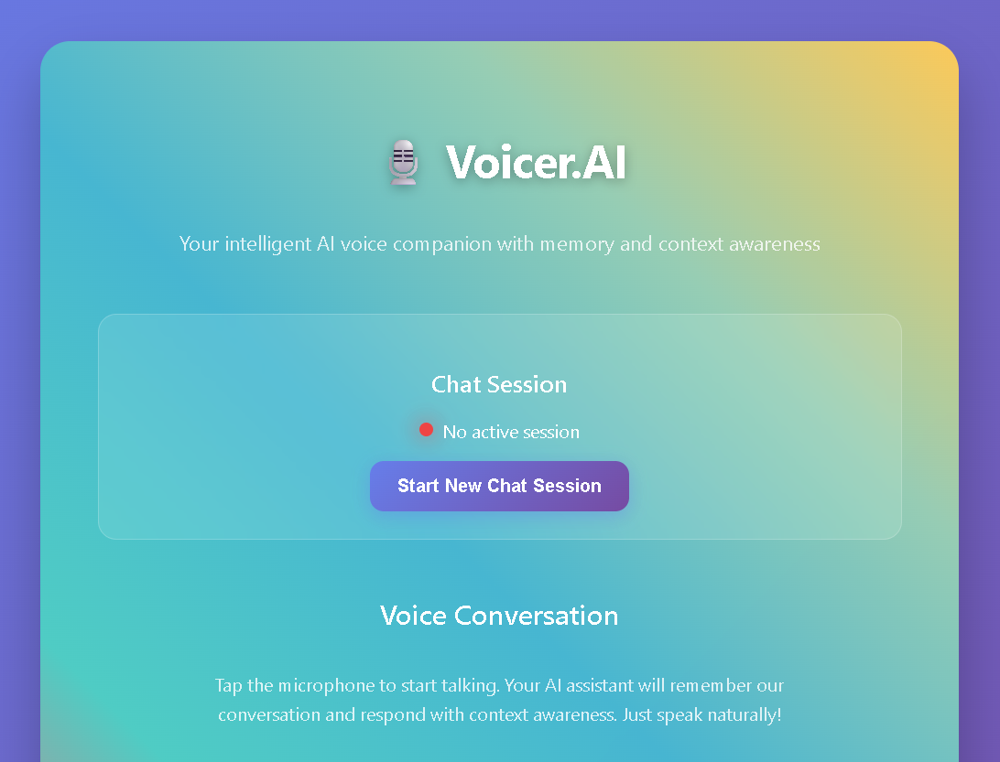
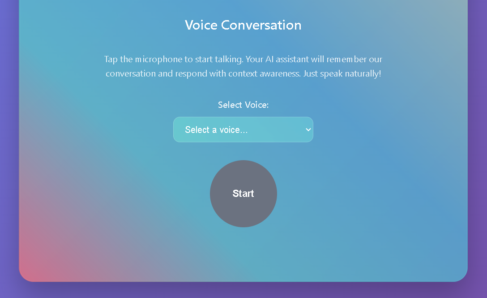
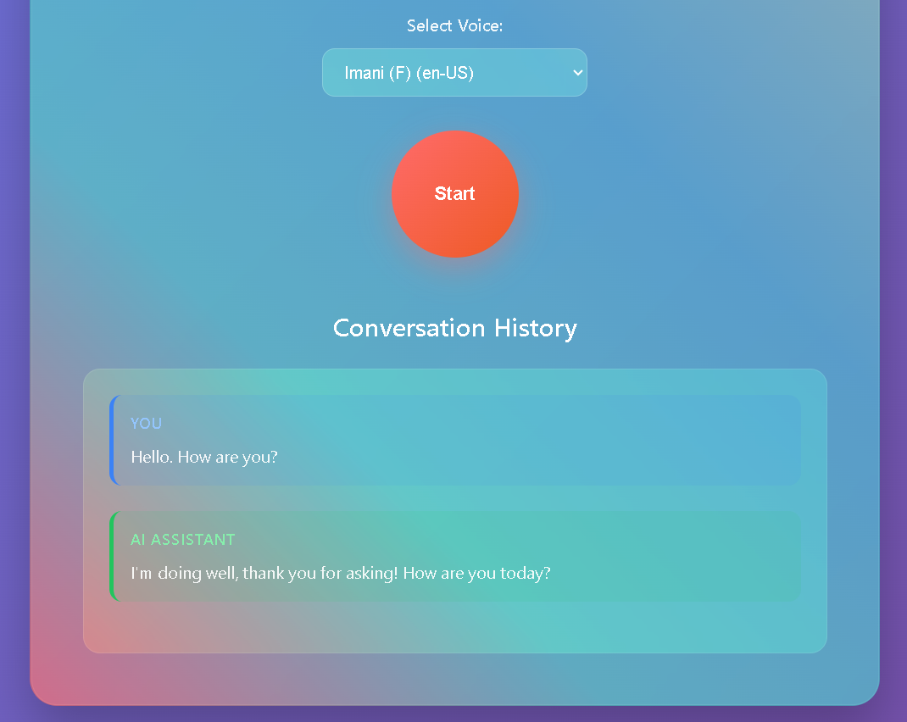
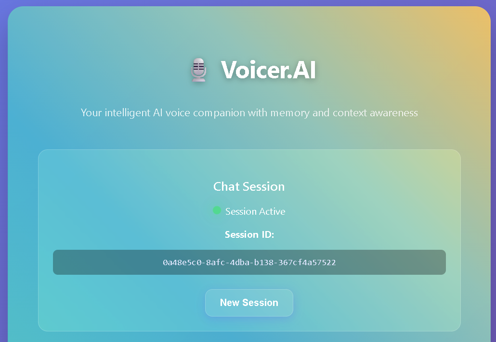

# Voicer.AI: Conversational AI Voice Agent Platform

## 🚀 Project Overview
Voicer.AI is a next-generation, full-stack conversational voice agent platform. It combines real-time speech-to-text, LLM-powered chat, and ultra-realistic TTS, all wrapped in a modern, animated web UI. Designed for rapid prototyping and extensibility, Voicer.AI is your playground for building, testing, and deploying AI voice agents with state-of-the-art APIs.

---

## 🛠️ Technologies Used
- **FastAPI**: Lightning-fast Python web framework for APIs
- **AssemblyAI**: Speech-to-text (STT) transcription (async, robust, accurate)
- **Murf API**: Text-to-speech (TTS) with a wide range of realistic voices
- **Google Gemini (Generative AI)**: LLM for chat, summarization, and more
- **HTML/CSS/JS**: Modern, animated frontend (MediaRecorder, fetch, async UI)
- **pydub + ffmpeg**: (Optional) Audio format conversion for maximum compatibility
- **Python 3.8+**: Core language
- **dotenv**: Secure environment variable management

---

## 🏗️ Architecture
- **Frontend**: Single-page app (SPA) served via FastAPI static files. Uses MediaRecorder for browser-based audio capture, fetch for async API calls, and a beautiful dark UI.
- **Backend**: FastAPI server with endpoints for:
  - `/generate`: TTS via Murf
  - `/voices`: List available Murf voices
  - `/upload_audio`: Save uploaded audio
  - `/transcribe/file`: Transcribe audio (AssemblyAI)
  - `/tts/echo`: Record, transcribe, and echo back as TTS
  - `/llm/query`: Full pipeline: audio → transcript → LLM → TTS
  - `/agent/chat/{session_id}`: Conversational chat with history
- **Transcription**: Audio is uploaded, optionally converted to WAV/MP3, then sent to AssemblyAI for transcription.
- **LLM**: Gemini (Google) for chat, summarization, and context-aware responses.
- **TTS**: Murf API for ultra-realistic voice synthesis.
- **Session Management**: In-memory chat history (can be swapped for Redis, DB, etc.)

---

## ✨ Features
- 🎤 **Voice Interaction**: Real-time speech recognition and natural TTS responses
- 🎵 **AI Music Generation**: Create custom music tracks using Sonauto AI
- � **News Integration**: Get latest news updates through voice commands
- 🗣️ **Multiple Personas**: Choose from various AI personalities (Professor, Doctor, Engineer, etc.)
- � **Context-Aware Chat**: Persistent conversation history across sessions
- � **Modern UI**: Dark-themed, animated interface with real-time feedback
- � **Easy Configuration**: Simple settings modal for API key management
- 🌐 **WebSocket Support**: Real-time bidirectional communication
- 🔒 **Secure**: API keys and secrets managed via settings or `.env`
- 🧩 **Extensible**: Modular architecture for easy feature additions

---

## ⚡ Quickstart

### 1. Clone the Repo
```sh
git clone <your-repo-url>
cd pro_day_1
```

### 2. Install Python Dependencies
```sh
pip install -r requirements.txt
```

### 3. Install ffmpeg (for audio conversion)
- **Windows**: Download from https://ffmpeg.org/download.html and add to PATH
- **macOS**: `brew install ffmpeg`
- **Linux**: `sudo apt-get install ffmpeg`

### 4. Set Environment Variables
Create a `.env` file in the project root with the following:
```
MURF_API_KEY=your_murf_api_key          # Get from https://murf.ai/api/api-keys
ASSEMBLYAI_API_KEY=your_assemblyai_api_key    # Get from https://www.assemblyai.com/dashboard/api-keys
GEMINI_API_KEY=your_gemini_api_key      # Get from https://aistudio.google.com/apikey
NEWS_API_KEY=your_news_api_key          # Get from https://newsapi.org/account
SONAUTO_API_KEY=your_sonauto_api_key    # Get from https://sonauto.ai/developers#api-keys
```

Alternatively, you can configure these API keys through the settings modal in the web interface.

### 5. Run the FastAPI Server
```sh
uvicorn app:app --reload
```

### 6. Open the App
Go to [http://127.0.0.1:8000](http://127.0.0.1:8000) in your browser.

---

## 🔗 API Endpoints
- `POST /generate` — Generate TTS audio from text
- `GET /voices` — List available Murf voices
- `POST /upload_audio` — Upload and save audio file
- `POST /transcribe/file` — Transcribe audio file (AssemblyAI)
- `POST /tts/echo` — Record, transcribe, and echo as TTS
- `POST /llm/query` — Full pipeline: audio → transcript → LLM → TTS
- `POST /agent/session` — Create a new chat session
- `GET /agent/chat/{session_id}` — Get chat history
- `POST /agent/chat/{session_id}` — Conversational chat with history

---

## 🧠 Required API Keys
- `MURF_API_KEY` — For text-to-speech synthesis (get from https://murf.ai/api/api-keys)
- `ASSEMBLYAI_API_KEY` — For speech recognition (get from https://www.assemblyai.com/dashboard/api-keys)
- `GEMINI_API_KEY` — For AI conversations (get from https://aistudio.google.com/apikey)
- `NEWS_API_KEY` — For news integration (get from https://newsapi.org/account)
- `SONAUTO_API_KEY` — For AI music generation (get from https://sonauto.ai/developers#api-keys)

All API keys can be configured either through environment variables or the settings modal in the web interface.

---

## 💡 Pro Tips
- For best results, use a high-quality microphone and record in a quiet environment.
- You can swap out the LLM or TTS provider by editing a single function.
- The UI is fully customizable—make it your own!
- All endpoints are CORS-enabled for easy frontend integration.

---

## 🌟 Why Voicer.AI Stands Out
- **Full pipeline**: Audio → Transcription → LLM → TTS, all in one place
- **Modern, animated UI**: Not just functional, but beautiful
- **Plug-and-play**: Add new models, voices, or features in minutes
- **Built for hackers, by hackers**: Rapid prototyping, easy to extend

---

## 🎯 Key Features in Detail

### 🗣️ Voice Interaction
The application uses AssemblyAI's real-time speech recognition to convert your voice into text, processes it through Google's Gemini AI for intelligent responses, and converts those responses back to speech using Murf.AI's natural-sounding voices.

### 🎵 AI Music Generation
Using Sonauto's advanced AI music generation capabilities, users can request custom music tracks. Simply ask for a specific type of music (e.g., "create some lofi beats" or "generate a meditation track"), and the AI will compose and stream a unique piece.

### 📰 News Integration
Stay updated with the latest news through voice commands. Ask about specific topics (e.g., "what's the latest tech news?" or "tell me about business headlines"), and the system will fetch and summarize relevant articles using NewsAPI.

### 🎨 Modern Interface
- Clean, intuitive dark-themed design
- Real-time visual feedback for all operations
- Easy API key management through settings modal
- Interactive chat history with persona indicators
- Multiple voice and persona options

## 🖼️ Screenshots

### Home Page


### Voice AI Panel


### Interaction with AI (Chat/LLM)


### After Session Creation


---

## 📝 License
MIT License. Use, remix, and build your own voice agents!

---

## 🙏 Credits
- [AssemblyAI](https://www.assemblyai.com)
- [Murf](https://murf.ai)
- [Google Gemini](https://aistudio.google.com)
- [FastAPI](https://fastapi.tiangolo.com)
- [pydub](https://github.com/jiaaro/pydub)

---

> Made with 💙 by the Voicer.AI team. Unleash your voice, unleash your ideas!

